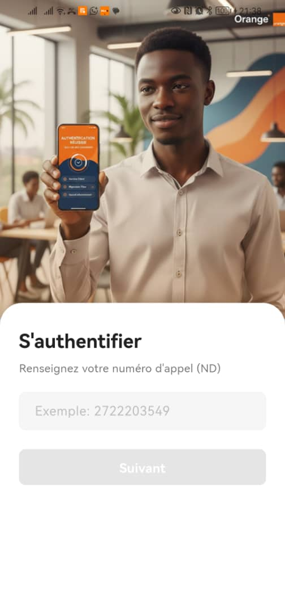
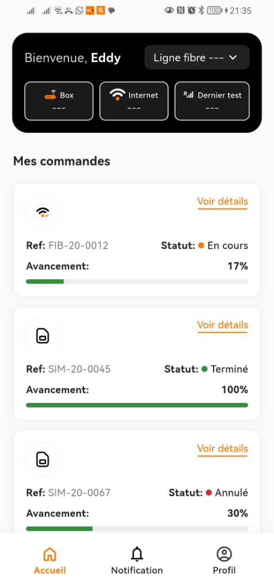
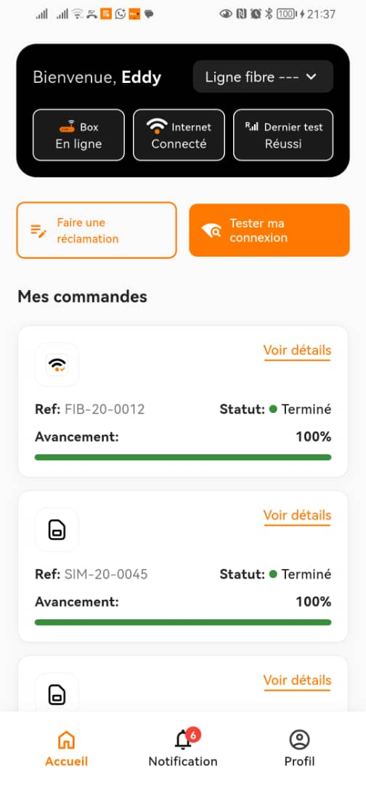
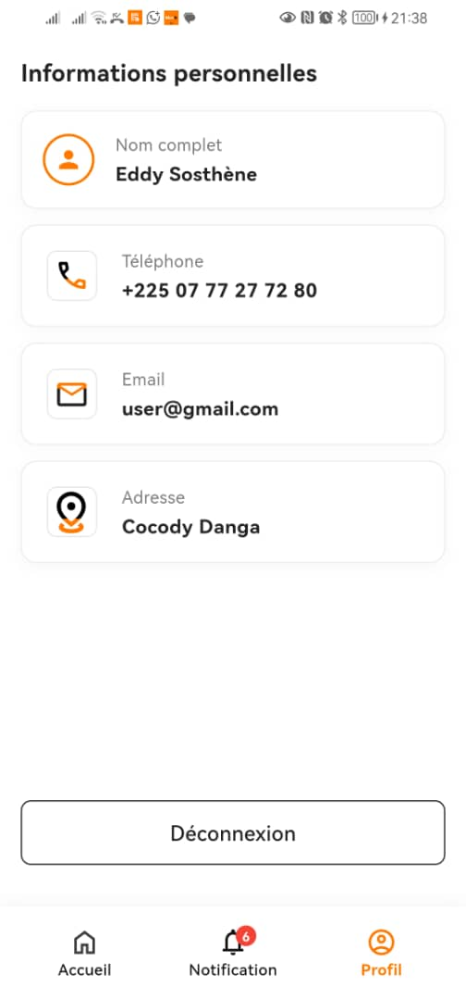
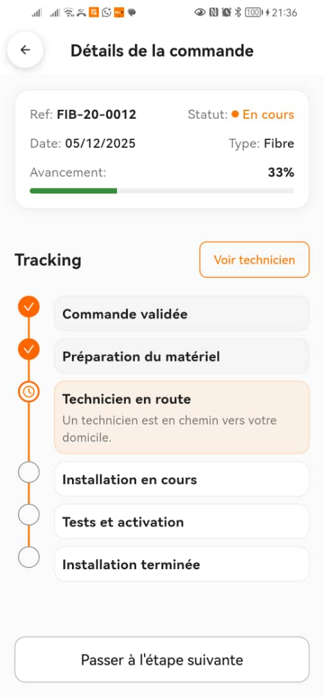
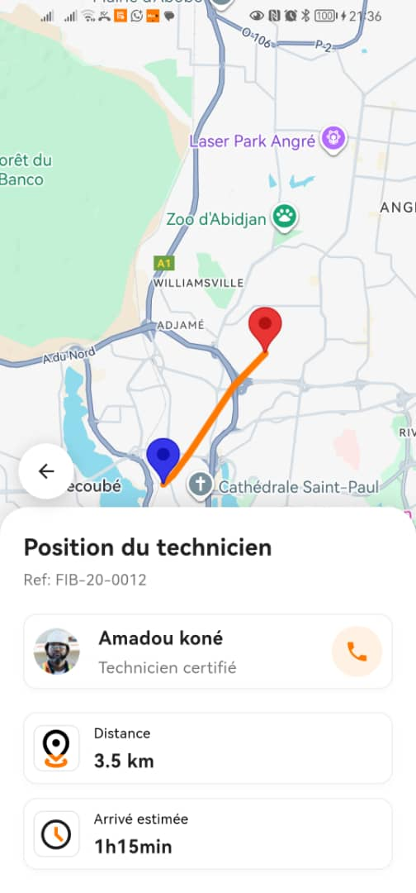
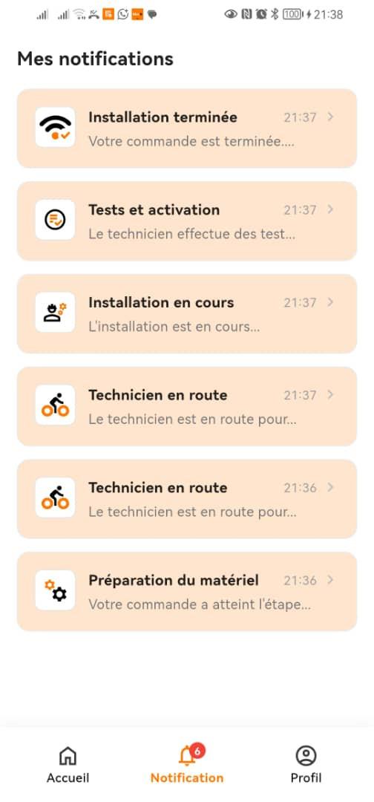
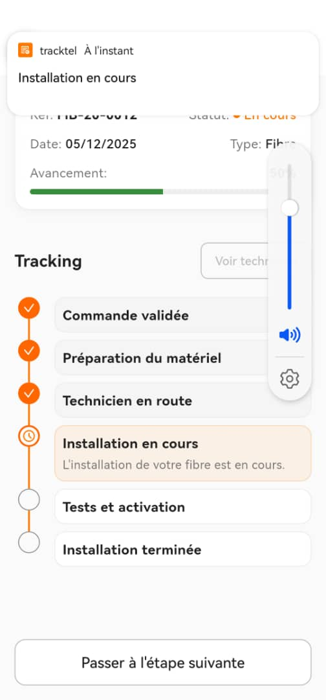
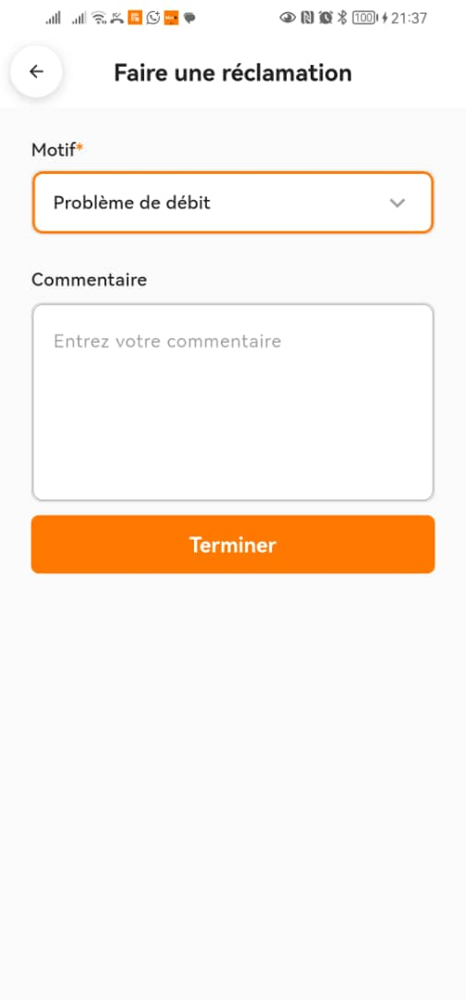
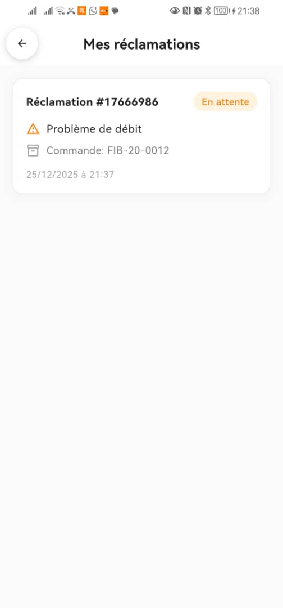

# TrackTel 📱

Application mobile de suivi intelligent des commandes de télécommunications développée avec Flutter.

## 📋 Description du Projet

TrackTel est une application mobile cross-platform permettant aux clients de suivre en temps réel l'état de leurs commandes de services de télécommunications (fibre, box, SIM, intervention). L'application offre une interface intuitive pour visualiser la progression des commandes, tester la connexion internet, faire des réclamations et suivre la localisation des techniciens en route.

## Fonctionnalités Implémentées

### Authentification

-   Connexion par numéro de téléphone
-   Vérification par code OTP
-   Gestion de session persistante
-   Écran splash avec animation de transition

### Dashboard

-   Affichage des cartes de statut (Box, Internet, Dernier test)
-   Indicateurs visuels avec pastilles de statut
-   Sélection de ligne (Fibre, Mobile)
-   Liste des commandes actives avec filtres
-   Boutons d'action conditionnels (visibles uniquement quand la commande fibre est terminée)

### Suivi de Commandes

-   Affichage détaillé de chaque commande
-   Barre de progression avec étapes
-   Workflow dynamique selon le type de commande :
    -   **Fibre/Box** : 6 étapes (Validation → Attribution → Étude → Pose → Installation → Terminé)
    -   **SIM** : 5 étapes
    -   **Intervention** : 4 étapes
-   Historique des étapes avec horodatage
-   Bouton "Voir technicien" actif uniquement à l'étape "Technicien en route"

### Localisation du Technicien

-   Carte Google Maps en temps réel
-   Marqueurs pour position du technicien et du client
-   Trajet de navigation avec points intermédiaires
-   Informations du technicien (photo, nom, certification)
-   Affichage de la distance et temps d'arrivée estimé
-   Bouton d'appel direct

### Test de Connexion

-   Bottom sheet avec animation de vagues
-   Simulation de test (3 secondes)
-   Affichage du résultat (échec)
-   Option de refaire le test en cas d'échec

### Notifications

-   Notifications automatiques à chaque avancement de commande
-   Badge avec compteur de notifications non lues
-   Écran de liste des notifications
-   Détails des notifications avec actions contextuelles

### Réclamations

-   Formulaire de création de réclamation
-   Sélection du type de problème
-   Description détaillée
-   Historique des réclamations
-   Suivi du statut (En attente, En cours, Résolu, Rejeté)

### Profil Utilisateur

-   Informations personnelles
-   Paramètres de l'application
-   Gestion du thème (clair/sombre)
-   Déconnexion

## Architecture Adoptée

Le projet suit les principes de la **Clean Architecture** avec une séparation claire des responsabilités en couches :

```
lib/
├── core/                           # Configuration centrale
│   ├── constants/                  # Constantes globales
│   ├── router/                     # Configuration de navigation (GoRouter)
│   ├── services/                   # Services système (notifications)
│   └── theme/                      # Thème et couleurs de l'application
│
├── data/                           # Couche de données
│   ├── models/                     # Modèles de données (DTOs)
│   ├── repositories/               # Implémentations des repositories
│   └── mock/                       # Données mock pour le développement
│
├── domain/                         # Couche métier
│   ├── entities/                   # Entités métier (OrderEntity, NotificationEntity, etc.)
│   └── usecases/                   # Cas d'usage métier
│       ├── add_notification_usecase.dart
│       ├── get_notifications_usecase.dart
│       └── ...
│
└── presentation/                   # Couche présentation
    ├── screens/                    # Écrans de l'application
    │   ├── splash_screen.dart
    │   ├── login_phone_screen.dart
    │   ├── dashboard_screen.dart
    │   ├── order_details_screen.dart
    │   ├── technician_location_screen.dart
    │   └── ...
    ├── widgets/                    # Widgets réutilisables
    │   ├── action_buttons.dart
    │   ├── box_status_cards.dart
    │   ├── connection_test_bottom_sheet.dart
    │   ├── connection_test_result_bottom_sheet.dart
    │   └── ...
    └── viewmodels/                 # Gestion d'état (Riverpod)
        ├── auth_viewmodel.dart
        ├── orders_viewmodel.dart
        ├── notifications_viewmodel.dart
        └── ...
```

### Principes Architecturaux

-   ✅ **Séparation des préoccupations** : Chaque couche a une responsabilité unique
-   ✅ **Dépendances unidirectionnelles** : Domain ← Data ← Presentation
-   ✅ **Inversion de dépendances** : Utilisation d'abstractions (repositories)
-   ✅ **Testabilité** : Chaque composant peut être testé indépendamment
-   ✅ **Réutilisabilité** : Widgets et use cases modulaires
-   ✅ **Maintenabilité** : Code organisé et documenté

### Gestion d'État

-   **Riverpod** pour la gestion d'état réactive
-   StateNotifier pour les états complexes
-   Provider pour l'injection de dépendances

### Navigation

-   **GoRouter** pour la navigation déclarative
-   Routes nommées avec paramètres typés
-   Redirections conditionnelles (authentification)
-   Deep linking ready

## Bibliothèques Utilisées

### Core Dependencies

```yaml
dependencies:
    flutter_sdk: ^3.29.3

    # Gestion d'état
    flutter_riverpod: ^2.5.1

    # Navigation
    go_router: ^14.2.0

    # Stockage local
    shared_preferences: ^2.2.3

    #  Dates
    intl: ^0.19.0

    # UI & Assets
    flutter_svg: ^2.0.10+1
    cupertino_icons: ^1.0.8

    # Notifications
    flutter_local_notifications: ^18.0.1

    # Carte & Localisation
    google_maps_flutter: ^2.10.0
```

### Dev Dependencies

```yaml
dev_dependencies:
    flutter_test:
        sdk: flutter
    flutter_lints: ^5.0.0
    flutter_launcher_icons: ^0.14.3
```

## Instructions de Build

### Prérequis

-   Flutter SDK 3.29.3 ou supérieur
-   Dart SDK 3.7.2 ou supérieur
-   Android Studio / Xcode/Vs code (selon votre preference)
-   CLE API Google Maps

### Configuration

1. **Cloner le repository**

    ```bash
    git clone https://github.com/ZHKING13/TrackTel.git
    cd TrackTel
    ```

2. **Installer les dépendances**

    ```bash
    flutter pub get
    ```

3. **Configurer les clés API Google Maps**

    a. Créer un fichier `android/local.properties` (si non existant) et ajouter :

    ```properties
    GOOGLE_MAPS_API_KEY=votre_cle_api_google_maps
    ```

    b. Configurer iOS dans `ios/Runner/AppDelegate.swift` :

    ```swift
    GMSServices.provideAPIKey("votre_cle_api_google_maps")
    ```

4. **Générer les icônes de l'application**
    ```bash
    flutter pub run flutter_launcher_icons
    ```

### Build pour Android

```bash
# Debug
flutter run

# Release APK
flutter build apk --release

# Release App Bundle (pour Google Play Store)
flutter build appbundle --release
```

### Build pour iOS

```bash
# Debug
flutter run

# Release
flutter build ios --release
```

### Build pour Web

```bash
flutter build web --release
```

## 📸 Captures d'Écran

### Authentification

<table>
  <tr>
    <td align="center">
      
      <br/>
      <em>Écran de connexion</em>
    </td>
    <td align="center">
      
      <br/>
      <em>Vérification OTP</em>
    </td>
  </tr>
</table>

### Dashboard

<table>
  <tr>
    <td align="center">
      
      <br/>
      <em>Dashboard principal</em>
    </td>
    <td align="center">
      
      <br/>
      <em>Dashboard avec actions</em>
    </td>
    <td align="center">
      
      <br/>
      <em>Profil utilisateur</em>
    </td>
  </tr>
</table>

### Suivi de Commande

<table>
  <tr>
    <td align="center">
      
      <br/>
      <em>Détails de commande</em>
    </td>
    <td align="center">
      
      <br/>
      <em>Localisation technicien</em>
    </td>
  </tr>
</table>

### Notifications

<table>
  <tr>
    <td align="center">
      
      <br/>
      <em>Liste des notifications</em>
    </td>
    <td align="center">
      
      <br/>
      <em>Push notification</em>
    </td>
  </tr>
</table>

### Réclamations

<table>
  <tr>
    <td align="center">
      
      <br/>
      <em>Formulaire de réclamation</em>
    </td>
    <td align="center">
      
      <br/>
      <em>Historique des réclamations</em>
    </td>
  </tr>
</table>

### Test de Connexion

<table>
  <tr>
    <td align="center">
      
      <br/>
      <em>Test de connexion</em>
    </td>
  </tr>
</table>

## Données Mock Utilisées

### Commandes Mock

#### Commande Fibre (Terminée)

```dart
{
  "reference": "FIB-2024-001",
  "type": OrderType.fibre,
  "status": OrderStatus.completed,
  "progress": 100,
  "createdAt": "2024-12-15",
  "steps": [
    "Commande validée",
    "Attribution au technicien",
    "Étude technique",
    "Pose de câble",
    "Installation box",
    "Installation terminée"
  ]
}
```

#### Commande Box (En cours)

```dart
{
  "reference": "BOX-2024-002",
  "type": OrderType.box,
  "status": OrderStatus.inProgress,
  "progress": 50,
  "currentStep": "Technicien en route"
}
```

#### Commande SIM (En attente)

```dart
{
  "reference": "SIM-2024-003",
  "type": OrderType.sim,
  "status": OrderStatus.pending,
  "progress": 20,
  "currentStep": "Validation commande"
}
```

### Notifications Mock

```dart
[
  {
    "id": "notif_001",
    "title": "Commande validée",
    "message": "Votre commande FIB-2024-001 a été validée",
    "type": NotificationType.orderValidated,
    "timestamp": "2024-12-20 10:30",
    "isRead": false
  },
  {
    "id": "notif_002",
    "title": "Technicien en route",
    "message": "Le technicien Amadou Koné est en route vers votre domicile",
    "type": NotificationType.technicianOnRoute,
    "timestamp": "2024-12-20 14:15",
    "isRead": false
  }
]
```

### Données de Localisation

```dart
{
  "technicianPosition": {
    "latitude": 5.3364,
    "longitude": -4.0267,
    "name": "Amadou Koné",
    "phone": "+225 07 XX XX XX XX"
  },
  "clientPosition": {
    "latitude": 5.3599,
    "longitude": -4.0083
  },
  "estimatedDistance": "3.5 km",
  "estimatedTime": "1h15min"
}
```

### Statuts de Box (Après Installation)

```dart
{
  "box": {
    "status": "En ligne",
    "indicator": "green"
  },
  "internet": {
    "status": "Connecté",
    "indicator": "green"
  },
  "lastTest": {
    "status": "Réussi",
    "indicator": "green"
  }
}
```

## Thème et Design

-   **Police** : Roboto (Material Design)
-   **Couleur principale** : Orange (#FF6B35)
-   **Mode sombre** : Supporté avec thème adaptatif
-   **Design System** : Material Design 3

## Sécurité

-   Fichiers sensibles dans `.gitignore`
-   Validation des entrées utilisateur
-   Gestion sécurisée des sessions

## 👥 Contributeurs

-   **ZHKING13** - Développeur principal

## 📄 Licence

Ce projet est sous licence privée. Tous droits réservés.

## 📧 Contact

Pour toute question ou suggestion, veuillez contacter : [sergekota@gmail.com]

---

**Développé avec ❤️ en utilisant Flutter**
